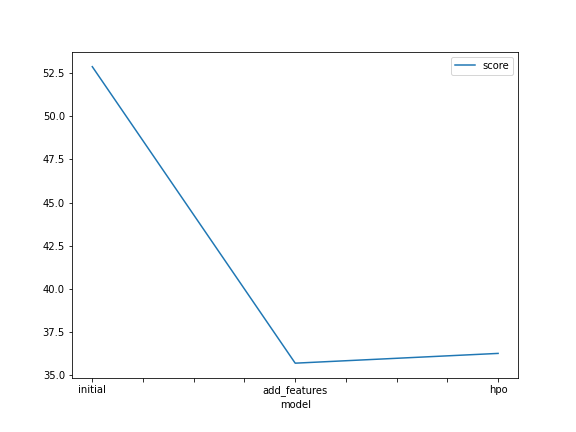
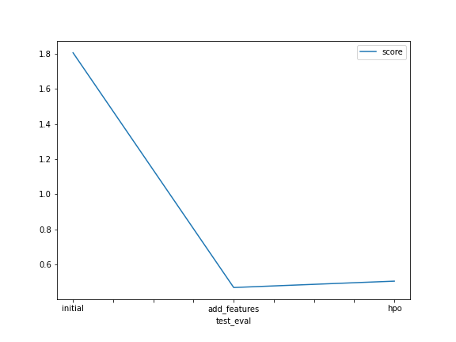

# Report: Predict Bike Sharing Demand with AutoGluon Solution
#### GUSTAVO JORGE MARTINS DE AGUIAR

## Initial Training
### What did you realize when you tried to submit your predictions? What changes were needed to the output of the predictor to submit your results?

The model did not perform as well as predicted the first time I utilized the raw dataset because I had not committed any data analysis or feature engineering. I had to substitute the negative integers with 0 to submit my findings to Kaggle.

### What was the top ranked model that performed?

Results utilizing the dataset with new features and the WeightedEnsemble L3 model were best.

## Exploratory data analysis and feature creation
### What did the exploratory analysis find and how did you add additional features?

I separated the datetime into month, day, year, and hour for the added features. Additionally, it was helpful to categorize the season and weather features.

### How much better did your model preform after adding additional features and why do you think that is?

I chose to split the datetime in this case because doing so allows the model to analyze seasonality patterns in the data, which is essential for a regression model.

## Hyper parameter tuning
### How much better did your model preform after trying different hyper parameters?

Although effective in some circumstances, hyperparameter adjustment did not significantly increase my model performance.

### If you were given more time with this dataset, where do you think you would spend more time?

Perform a more extensive data analysis, feature engineering, and additional research on hyperparameters.

### Create a table with the models you ran, the hyperparameters modified, and the kaggle score.
|model|hpo1|hpo2|hpo3|hpo4|hpo5|hpo6|hpo7|score|
|--|--|--|--|--|
|initial|default|default|default|default|default|default|default|1.80619
|add_features|default|default|default|default|default|default|default|0.46933
|hpo|GBM: num_boost_round: 100|GBM: learning_rate: ag.Real(0.01, 0.1, log=True)|XGB: n_estimators: 1000|XGB: learning_rate: ag.Real(0.01, 0.1, log=True)|NN_TORCH: num_epochs: 10|NN_TORCH: activation: relu|NN_TORCH: dropout_prob: ag.Real(0.0, 0.5)|0.50567

### Create a line plot showing the top model score for the three (or more) training runs during the project.

### Create a line plot showing the top kaggle score for the three (or more) prediction submissions during the project.

## Summary
The skills I learned in this course unit were all used in this project, allowing me to create a machine-learning regression model using the autogluon framework. The results were successful because my model's Kaggle score was comparable to that of experienced professionals.
